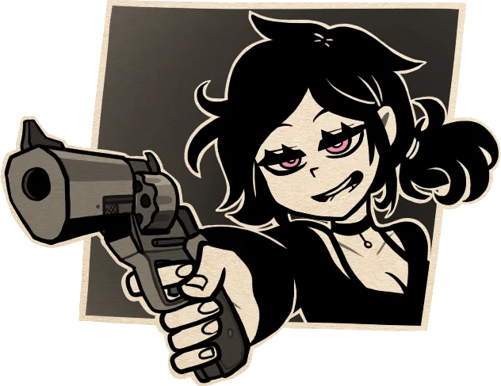

<h1 align="center">^._.^</h1>

<h3><pre align="center">【Oh... Hi choom! What's going on? Is everything good?】</pre></h3>

  
  

    <pre>Don't do anything cocky and everything will be just fine, right?</pre>
    <ul>
        <li>Name: Azim</li>
        <li>Age: ❄️19☀️</li>
        <li>Gender: 🔥He/Him/Male🔥</li>
        <li>Love: ❤️IT, games, anime💛</li>
        <li>Flower: 💮Lotus💮</li>
    </ul>
 

<pre>It wasn't loaded anyways...</pre>
      <ul>
        <li>Working: ⚫Undercover⚫ (aka unemployed)</li>
        <li>Learning: 📓C++📓</li>
        <li>University: 🔭<abbr title="American University of Central Asia">AUCA</abbr>🔭</li>
        <li>Studying: 💻Software Engineering💻</li>
      </ul>  
<!--
**azimia404/azimia404** is a ✨ _special_ ✨ repository because its `README.md` (this file) appears on your GitHub profile.

Here are some ideas to get you started:

- 🔭 I’m currently working on ...
- 🌱 I’m currently learning ...
- 👯 I’m looking to collaborate on ...
- 🤔 I’m looking for help with ...
- 💬 Ask me about ...
- 📫 How to reach me: ...
- 😄 Pronouns: ...
- ⚡ Fun fact: ...
  -->